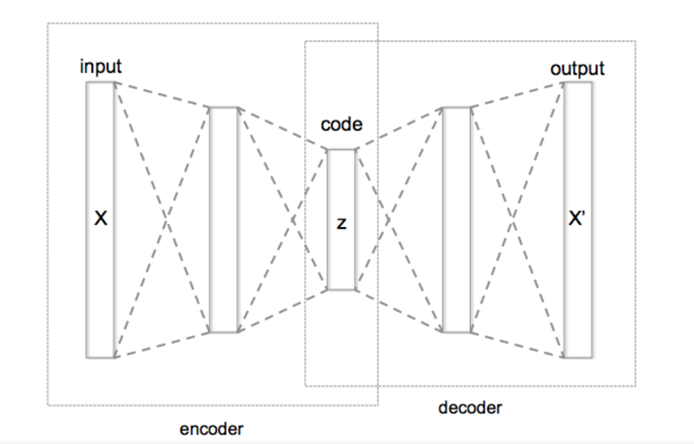
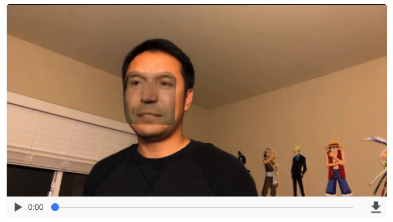

# DeepFake
Deepfake, a portmanteau of "deep learning" and "fake",is an artificial intelligence-based human image synthesis technique. It is used to combine and superimpose existing images and videos onto source images or videos. A machine learning technique called a "generative adversarial network" (GAN) can be used to create fake videos.

This code is based on the approach outlined in [Faceswap](https://github.com/deepfakes/faceswap)'s repo, running on google colab.

The model has been trained only a couple of hours. Of course it can be much better, if you have more closer resources, and run longer time
